 

 

**CodeLeafy** — developer building networking tools, desktop apps, and Telegram bots.

---

## Projects

| Project | Description | Language | Stars |
| --- | --- | --- | --- |
| [Canval](https://github.com/Code-Leafy/Canval) | Infinite canvas for real PTY-backed CLI terminals, notes, and agent workflows on Windows |  |  |
| [Hydro](https://github.com/Code-Leafy/hydro) | Single-file media downloader for Google Colab — videos, playlists, audio and images via a free Cloudflare tunnel |  |  |
| [V2Leafy](https://github.com/Code-Leafy/V2Leafy) | Web dashboard for managing Xray VLESS WS configs on GitHub Codespaces and Railway |  |  |
| [OpenGui](https://github.com/Code-Leafy/OpenGui) | Native Windows desktop client for OpenConnect VPNs, built with Tauri 2 |  |  |
| [SparkDns](https://github.com/Code-Leafy/SparkDns) | Cross-platform DNS management desktop app built with Tauri 2 |  |  |
| [NetLeafyScanner](https://github.com/Code-Leafy/NetLeafyScanner) | Massively parallel IP/SNI discovery and real-proxy speed tester for VLESS and Trojan configs |  |  |
| [SshTunnel](https://github.com/Code-Leafy/SshTunnel) | One-command, optimized SOCKS5 proxy panel with TCP tuning for any VPS |  |  |
| [NetLeafy](https://github.com/Code-Leafy/NetLeafy) | Client-side VLESS-over-xHTTP configuration generator |  |  |

## Telegram bots

| Bot | Description | Stack |
| --- | --- | --- |
| [Shop Bot](https://t.me/niggajewbot) | Full Telegram storefront — catalog, cart, checkout, public admin panel, auto-reset demo mode |    |
| [Price Bot](https://t.me/ngachawtestbot) | Live gold / USD / EUR / GBP / oil prices, with direction indicators |    |

---

💻

